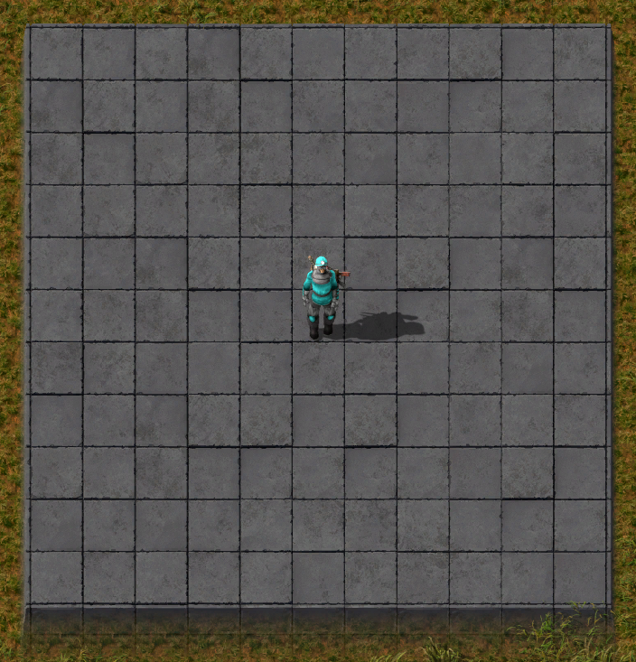
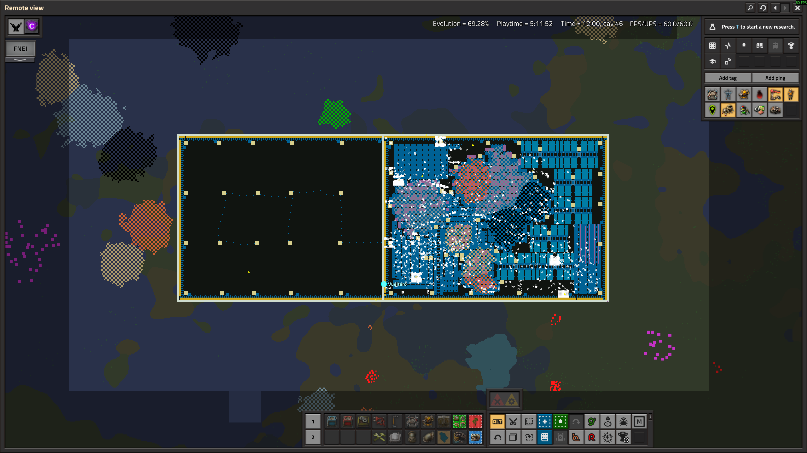
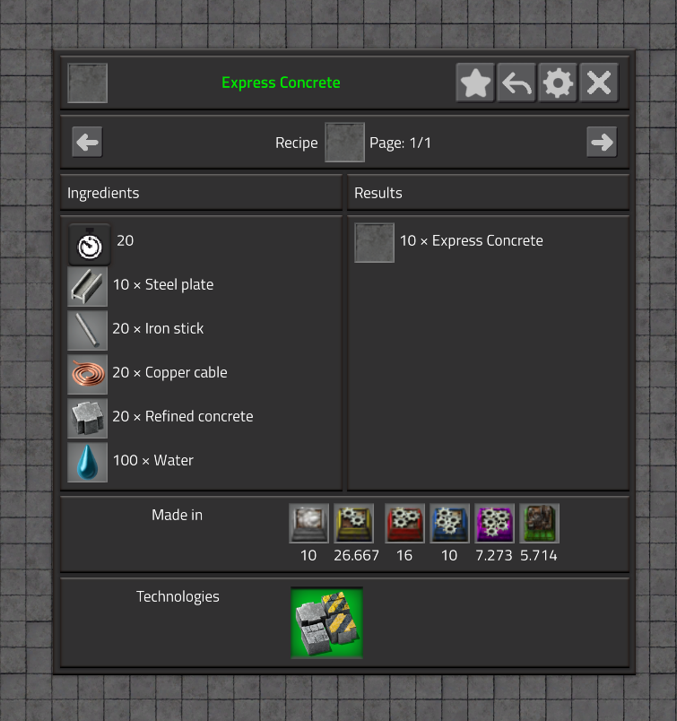
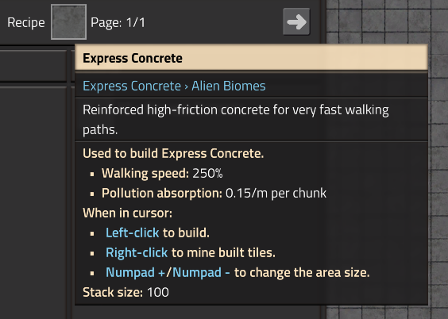

# Express Concrete

<p align="center">
  <strong>A clean, vanilla-style walking tile for Factorio with 250% movement speed.</strong>
</p>

<p align="center">
  
  
  
</p>

## Overview

**Express Concrete** adds one new late-concrete walking tile to vanilla Factorio: **Express Concrete**.

It is designed for players who want extremely fast factory movement without adding a large technology tree, complex progression system, or unrelated content. The mod keeps the scope intentionally small: one tile, one item, one recipe, one purpose.

Express Concrete is faster than stone brick, concrete, and refined concrete, but it also costs more than refined concrete to craft. It is meant for main bus lanes, mall corridors, megabase walkways, train-station platforms, defensive walls, and any high-traffic area where walking speed matters.

## Preview

| | |
|---|---|
|  |  |
|  |  |
|  |  |
|  |  |

## At a glance

| Property | Value |
|---|---|
| Tile | Express Concrete |
| Walking speed | 250% |
| Unlock | Concrete research |
| Recipe output | 10 tiles |
| Factorio version | 2.0 |
| Mod scope | One premium walking tile |

## Features

- Adds **Express Concrete**, a new placeable walking tile.
- Provides **250% walking speed**.
- Unlocks automatically with the vanilla **Concrete** technology.
- Outputs **10 tiles per craft**, matching the scale of other concrete-style recipes.
- Uses a vanilla-friendly recipe that is more expensive than refined concrete.
- Uses a clean visual style based on Factorio’s existing tile graphics.

## Balance

Express Concrete is intentionally powerful, but not free. It is meant to be a premium movement surface rather than a direct replacement for refined concrete in the early game.

### Recipe

Each craft produces **10 Express Concrete**.

| Ingredient | Amount |
|---|---:|
| Refined concrete | 20 |
| Steel plate | 10 |
| Iron stick | 20 |
| Copper cable | 20 |
| Water | 100 |

### Crafting time

| Output | Time |
|---|---:|
| 10 Express Concrete | 20 seconds |

### Why this cost?

Express Concrete is designed to sit above refined concrete as a high-end factory pathing tile. The extra steel, iron sticks, copper cable, water, and long crafting time make it expensive enough that covering an entire factory requires planning, while still making it practical for important movement corridors.

## Unlock

Express Concrete is unlocked by the vanilla **Concrete** research.

## Installation

### From a zip file

1. Download the latest release of the mod.
2. Place the zip file in your Factorio `mods` folder.
3. Start Factorio.
4. Enable **Express Concrete** in the Mods menu.
5. Load or start a save.

### From source

1. Clone or download this repository.
2. Make sure the folder name matches the mod name and version, for example:

```text
express-concrete_1.0.0
```

3. Place that folder inside your Factorio `mods` directory.
4. Start Factorio and enable the mod.

## Compatibility

Express Concrete is intentionally small and should be compatible with most mods.

The mod only adds:

- One tile prototype
- One item prototype
- One recipe prototype
- One unlock effect added to the vanilla Concrete technology

## Credits

Created by [**Vueltero**](https://www.youtube.com/Vueltero).   

The tile uses a vanilla-style visual approach based on Factorio’s existing tile graphics, with a tinted presentation inspired by the Space Concrete style from Spaceblock.

## Changelog

### 1.0.0

- Added Express Concrete.
- Added item, tile, recipe, locale, and technology unlock.
- Set walking speed modifier to 250%.
- Added high-cost recipe producing 10 tiles.
